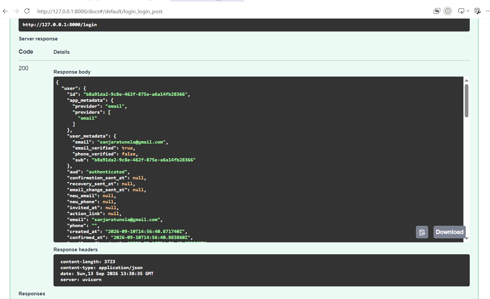
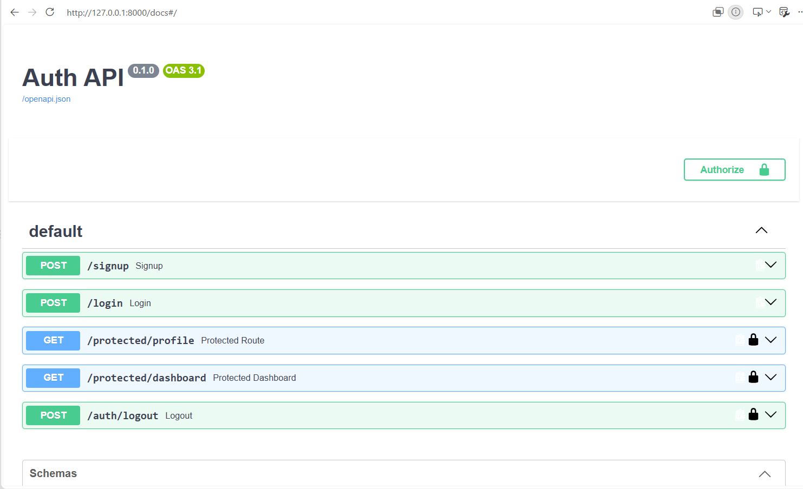
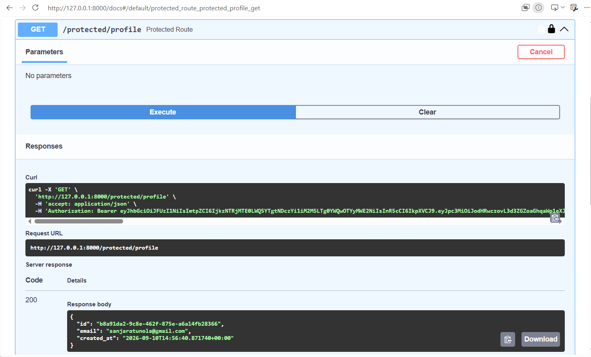

# FastAPI Auth API

A FastAPI authentication API using Supabase for user signup, login, JWT token verification, protected routes, and logout.

## Setup

Clone the repository and install dependencies:

```bash
git clone https://github.com/SanjaraT/Authentication_Practice
cd auth_api
pip install -r requirements.txt
```

Create a `.env` file:

```env
SUPABASE_URL=your_supabase_project_url
SUPABASE_KEY=your_supabase_anon_key
```

Run the API:

```bash
uvicorn main:app --reload
```

Swagger UI:

```text
http://localhost:8000/docs
```

## API Reference

| Method | Endpoint               | Auth |
| ------ | ---------------------- | ---- |
| POST   | `/signup`              | No   |
| POST   | `/login`               | No   |
| GET    | `/protected/profile`   | Yes  |
| GET    | `/protected/dashboard` | Yes  |
| POST   | `/auth/logout`         | Yes  |

Protected endpoints require:

```text
Authorization: Bearer <access_token>
```

## Swagger UI

### Login Success



### Authorized Swagger UI



### Protected Profile



